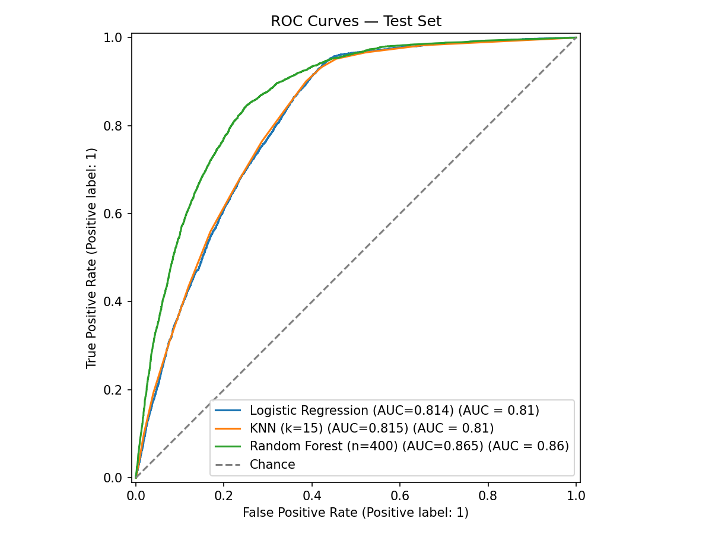
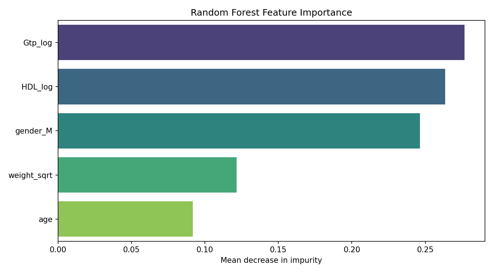

# Predicting Smoking Status from Clinical Biomarkers

A comparative machine-learning study on **55,692 health-screening records**, evaluating whether routine clinical biomarkers can identify smokers. Three classifiers (Logistic Regression, KNN, Random Forest) are benchmarked on a held-out test set, with formal statistical validation of every predictor.



## Key Results

| Model | AUC | Macro F1 | Accuracy |
|---|---|---|---|
| **Random Forest (n=400)** | **0.865** | **0.78** | **0.79** |
| KNN (k=15) | 0.815 | 0.72 | 0.73 |
| Logistic Regression | 0.814 | 0.72 | 0.73 |

- **Random Forest wins decisively** — the +0.05 AUC gap over both linear and instance-based baselines indicates meaningful non-linear structure in the biomarker–smoking relationship.
- **All 5 predictors are statistically significant** (p < 0.05): Mann-Whitney U tests for the skewed numerical features (age, weight, GTP, HDL) and a Chi-Square test for gender.
- **GTP (liver enzyme) and gender** carry the most predictive signal, consistent with the clinical literature on smoking's hepatic effects.



## Methodology

1. **Feature selection** — five predictors chosen from 27 columns: age, weight, GTP (gamma-glutamyl transferase), HDL cholesterol, gender.
2. **Statistical validation** — non-parametric Mann-Whitney U tests (appropriate for the skewed distributions) and Chi-Square, before any modelling.
3. **Skewness correction** — `log1p` transforms for GTP and HDL, square-root for weight (validated via Q-Q plots).
4. **Preprocessing** — one-hot encoding for gender; standard scaling fit on the training set only (no data leakage).
5. **Evaluation** — stratified 70/30 train/test split; ROC curves, confusion matrices, and per-class precision/recall on the held-out test set.

## Project Structure

```
├── main.py                 # Entry point: runs the full pipeline
├── data_preprocessing.py   # Loading, hypothesis testing, transformations
├── model_training.py       # Training, evaluation, figure generation
├── figures/                # Generated ROC curves, confusion matrices, importances
└── requirements.txt
```

## How to Run

1. Download the dataset ([Body Signal of Smoking, Kaggle](https://www.kaggle.com/datasets/kukuroo3/body-signal-of-smoking)) and place `smoking.csv` in the project root.
2. Install dependencies and run:

```bash
pip install -r requirements.txt
python main.py            # or: python main.py --data path/to/smoking.csv
```

All metrics are printed to the console and all figures are written to `figures/`.

## Tech Stack

**Python** · Pandas · NumPy · SciPy (hypothesis testing) · Scikit-Learn · Matplotlib · Seaborn
